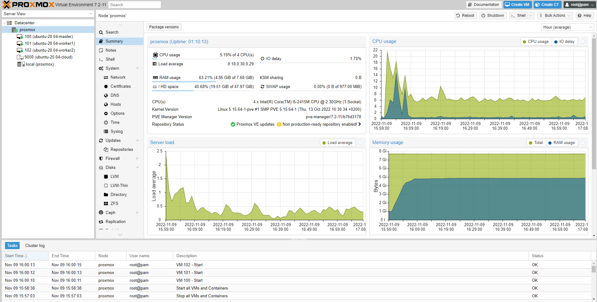
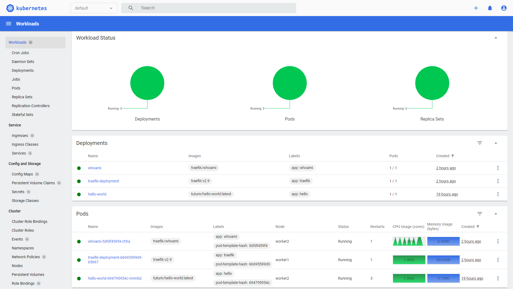

## K3S Cluster on Proxmox VMs

> A local k3s cluster that supports Load Balancer, Ingress Controller, and Cert Manager.

- [Step 1: Install Proxmox](1-proxmox-cloud-init/README.md).
- [Step 2: Set up K3s Cluster](2-k3sup-cluster/README.md).
- [Step 3: Install Application (MetalLB, Traefik, Cert-Manager)](3-deployment/README.md).

### Requirements

- A Router.
- A baremetal machine such as Intel NUC PC. We used a Mac-mini with 4CPUs and 8GB memory.

### Proxmox VE

Proxmox VE is an open-source server management platform for enterprise virtualization. We created three Ubuntu virtual machines (Cloud Init) to set up a K3S cluster.

### K3S Cluster

The local k3s cluster supports load balancer (**MetalLB**), ingress controller (**Traefik**), and self-signed TLS certificate (**Cert-Manager**).

